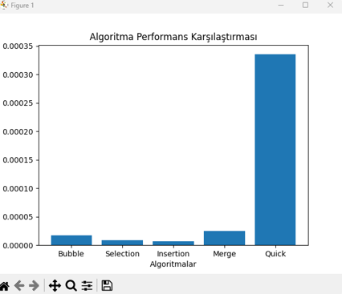

# 🚀 Veri Yapıları Ödevi – Arama ve Sıralama Algoritmaları


---

## ⭐ Proje Özeti

Bu projede temel **arama ve sıralama algoritmaları** Python ile uygulanmış,
aynı zamanda **performansları analiz edilerek karşılaştırılmıştır**.

👉 Amaç sadece algoritmaları yazmak değil,
**gerçek veri üzerinde nasıl davrandıklarını gözlemlemektir.**

---

## 🎬 Demo (GIF)


---

## 📊 Performans Grafiği



---

## 📂 Proje Yapısı

```id="tree1"
veri-yapilari-odev-arama-siralama/
│
├── main.py
├── requirements.txt
├── grafik.png
├── demo.gif
│
├── search/
│   ├── linear_search.py
│   └── binary_search.py
│
├── sorting/
│   ├── bubble_sort.py
│   ├── selection_sort.py
│   ├── insertion_sort.py
│   ├── merge_sort.py
│   └── quick_sort.py
│
└── README.md
```

---

## 🔍 Arama Algoritmaları

### 📌 Linear Search

* Liste baştan sona taranır
* İlk bulunan elemanın indeksini döndürür

**Zaman Karmaşıklığı:** O(n)

---

### 📌 Binary Search

* Sadece **sıralı listelerde** çalışır
* Ortadan bölerek arama yapar

**Zaman Karmaşıklığı:** O(log n)

---

### ⚠️ Önemli Gözlem

Binary Search her zaman ilk index’i vermez.

```id="example1"
Orijinal liste: [1, 2, 44, 55, 66, 3, 2]
Sıralı liste:   [1, 2, 2, 3, 44, 55, 66]
```

* Linear Search → index 1
* Binary Search → index 2

👉 Çünkü Binary Search ortadan bulur.

---

## 🔄 Sıralama Algoritmaları

### 🫧 Bubble Sort → O(n²)

### 🎯 Selection Sort → O(n²)

### ✍️ Insertion Sort → O(n²)

### ⚡ Merge Sort → O(n log n)

### 🚀 Quick Sort → O(n log n)

---

## ⚖️ Karşılaştırma

| Algoritma | Karmaşıklık | Performans |
| --------- | ----------- | ---------- |
| Bubble    | O(n²)       | 🐌         |
| Selection | O(n²)       | 🐌         |
| Insertion | O(n²)       | 🐌         |
| Merge     | O(n log n)  | ⚡          |
| Quick     | O(n log n)  | ⚡⚡         |

---

## 📊 Performans Analizi

Gerçek veri testlerinde:

* Küçük veri → fark az
* Büyük veri → fark çok büyük

👉 En iyi performans:

* **Quick Sort**
* **Merge Sort**

---

## ▶️ Kurulum ve Çalıştırma

```bash id="run1"
pip install -r requirements.txt
python main.py
```

---

## 🧪 Özellikler

* ✔ Kullanıcıdan veri alma
* ✔ Random veri üretimi
* ✔ Tüm algoritmaları karşılaştırma
* ✔ Süre ölçümü
* ✔ Grafiksel analiz
* ✔ Arama algoritmaları testi

---

## 🚀 Projede Yapılan Geliştirmeler

* Modüler kod yapısı
* Performans ölçüm sistemi
* Grafiksel karşılaştırma
* Görsel demo (GIF)
* Profesyonel README tasarımı

---

## 👨‍💻 Sonuç

Bu proje ile:

* Algoritmalar teoriden pratiğe taşındı
* Performans farkları net şekilde gözlemlendi
* Gerçek dünya kullanımı analiz edildi

---

⭐ Eğer projeyi beğendiysen yıldız bırakmayı unutma!
